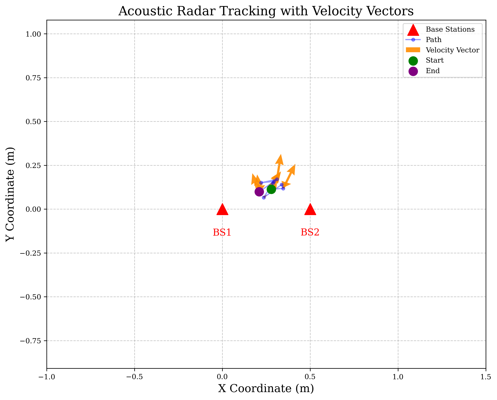
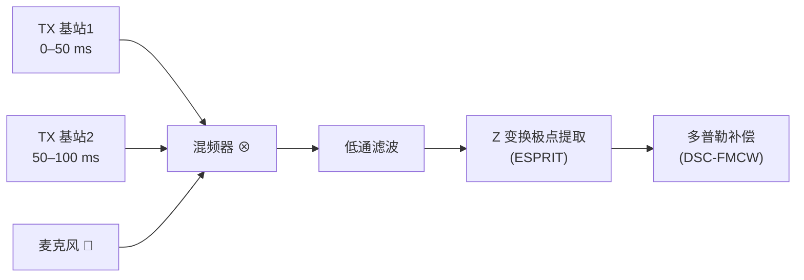

# 基于声学多普勒效应的双基站 FMCW 二维定位与测速系统

> **Acoustic Doppler Effect Based Dual-Anchor FMCW System for 2-D Localization and Velocity Estimation**

用两只廉价的商用扬声器、一块声卡和一只麦克风，在强多径的室内外环境下实现**厘米级二维定位**与**绝对速度矢量估计**。收发端引入 DSC-FMCW（Doppler Shift-Compensated FMCW）对称频率约束，在代数上彻底消除多普勒项；接收端用 ESPRIT 子空间算法在时域直接分离直射波，摆脱传统 FFT 寻峰对多径和栅栏效应的依赖。

*数字信号处理课程大作业 · 曹亦宸 · 2026 年 6 月*

---

## 目录

- [成果速览](#成果速览)
- [系统原理](#系统原理)
- [仓库结构](#仓库结构)
- [快速开始](#快速开始)
- [复现流程](#复现流程)
- [算法模块说明](#算法模块说明)
- [关键参数与约束](#关键参数与约束)
- [硬件复现清单](#硬件复现清单)
- [已知限制](#已知限制)
- [参考文献](#参考文献)
- [许可](#许可)

---

## 成果速览

| 实验 | 输入 | 指标 | 结果 |
|------|------|------|------|
| **一、圆周运动参数估计** | `sound.wav`（8 kHz 录音） | 声源线速度 `v` | **92.73 m/s** |
| | | 轨迹半径 `r` | **10.23 m** |
| | | 圆心到麦克风距离 `d` | **32.46 m** |
| **二、全链路仿真** | 物理层合成回声 | 定位误差 `ΔP` | **≈ 1.2 cm（相对 1.4%）** |
| | | 绝对速度矢量偏差 `ΔV` | **≈ 0.08 m/s** |
| **三、外场实测追踪** | `rx_field_test_raw.wav`（11 s） | 连续轨迹点 | **10 / 10 成功解算** |

下图是外场实测数据的解算轨迹与速度场（对应论文图 4）：红色三角为两个静态基站，蓝线为目标运动路径，橙色箭头为各点解算出的绝对速度矢量。



---

## 系统原理

### 1. 为什么是 4 kHz 基带？

高精度声学定位需要足够的信号带宽，但商用声卡的抗混叠滤波器在 20 kHz 附近就开始衰减。若沿用传统超声波频段（18 kHz 以上）以换取带宽，最高频率将直接击穿硬件天花板，导致接收信号严重失真。

本系统把整个波形压在 **4 ~ 12 kHz** 的可听频段内：起始频率 4 kHz，带宽 4 kHz，最高瞬时频率仅 12 kHz。既完美避开了商业设备的抗混叠衰减区，又拿到了 4 kHz 的可用带宽。

### 2. DSC-FMCW：用代数对称性消掉多普勒

单基站同时发射一对对称扫频信号：

- **Upchirp**：$f_0 \to f_0 + B$，即 $4000 \to 8000$ Hz
- **Downchirp**：$f_0' \to f_0' - B$，即 $12000 \to 8000$ Hz

**关键约束：$f_0' = f_0 + 2B$**（降频起点比升频起点高出整两倍带宽）。

目标运动带来的多普勒频移会让差频产生误差。设升频差频为 $f_p$、降频差频为 $f_p'$，则：

$$\frac{f_p' + f_p}{2} = \frac{1}{2}\left(\frac{BR}{cT} + \frac{B'R}{cT'} + \frac{(f_0 - f_0')v}{c} + \frac{(B + B')v}{c}\right) = \frac{1}{2}\left(\frac{2BR}{cT} - \frac{2Bv}{c} + \frac{2Bv}{c}\right) = \frac{BR}{cT}$$

多普勒项 $\frac{(f_0 - f_0')v}{c}$ 与 $\frac{(B+B')v}{c}$ 在此约束下**严格相消**，只剩距离项。于是得到与目标速度完全无关的距离公式：

$$\boxed{R = \frac{(f_p + f_p') \cdot c \cdot T}{2B}}$$

而速度则由两者之差单独给出：

$$\boxed{v_r = \frac{(f_p' - f_p) \cdot c}{2(f_0 + B)}}$$

相比传统 ToA / 频域配对方法，这里**不需要任何速度先验或惯性测量单元做补偿**，抗高速动态的能力来自波形设计本身。

### 3. ESPRIT：时域超分辨直射波提取

混频低通后的中频信号是多径分量的叠加。传统做法是 FFT 寻峰，但受栅栏效应限制（分辨率 ≈ $f_s/N$），且多径造成的谱畸变会让峰值配对失败。

本系统改用 **ESPRIT**（Estimation of Signal Parameters via Rotational Invariance Techniques）：

1. 对中频信号做 Hilbert 变换得到解析信号 $y[n] = \sum_k A_k z_k^n + w[n]$，其中 $z_k = e^{j2\pi f_k \Delta t}$；
2. 构造 Hankel 数据矩阵 $\mathbf{X}$，做 SVD 分解 $\mathbf{X} = \mathbf{U}\boldsymbol{\Sigma}\mathbf{V}^H$；
3. 按奇异值能量划分信号子空间 $\mathbf{U}_s$ 与噪声子空间，等价于对自协方差矩阵降噪；
4. 利用信号子空间的时移旋转不变性求解旋转矩阵 $\mathbf{U}_2 = \mathbf{U}_1\boldsymbol{\Phi}$；
5. 对 $\boldsymbol{\Phi}$ 做特征值分解，特征值相角即给出理论上**无限分辨率**的差频集合 $f_k = \frac{\angle\lambda_k}{2\pi T_s}$。

最后利用一条纯物理约束锁定直射波：**声波沿直线传播距离最短**，故直射波必然对应差频集合中的绝对最小值：

$$f_{\text{direct}} = \min\{f_1, f_2, \dots, f_K\}$$

系统因此完全不需要环境先验信息，也不需要复杂的波形配对。

### 4. 双基站几何解算

**定位**——以两基站为圆心、测得距离为半径作圆，求交点即为目标位置（闭式解，无迭代、无局部最优）：

$$a = \frac{R_1^2 - R_2^2 + d^2}{2d}, \qquad h = \sqrt{R_1^2 - a^2}$$

两个几何交点中，用"目标必位于基站连线单侧（$y>0$）"的场地先验唯一锁定真实坐标。

**测速**——径向速度是绝对速度在"目标→基站"单位方向上的正交投影。两基站观测方程联立得线性方程组 $\mathbf{A}\mathbf{v} = \mathbf{b}$，由于两基站不重合，$\mathbf{A}$ 必然满秩，直接求逆即得绝对速度矢量：

$$\begin{bmatrix} v_x \\ v_y \end{bmatrix} = \begin{bmatrix} \frac{x_1-x}{R_1} & \frac{y_1-y}{R_1} \\ \frac{x_2-x}{R_2} & \frac{y_2-y}{R_2} \end{bmatrix}^{-1} \begin{bmatrix} v_{r1} \\ v_{r2} \end{bmatrix}$$

### 5. TDM/FDM 双基站复用

两个基站若同时发声会互相串扰。系统采用**空分 + 时分**复用：

- 一个探测周期 **100 ms**：前 50 ms 基站 1 发声，后 50 ms 基站 2 发声（TDM）；
- 每个基站在自己的时隙内**同时**发射升频与降频信号（FDM）；
- 立体声 WAV 的左右声道分别驱动两个功放通道，一次播放即完成严格同步。



---

## 仓库结构

```
.
├── README.md                 本文档
├── requirements.txt          运行依赖
├── pyproject.toml            可选：pip install -e .
│
├── data/                     输入音频
│   ├── sound.wav                     圆周运动实测录音（8 kHz, 5 s）
│   ├── rx_field_test_raw.wav         双基站外场实测录音（48 kHz, 11 s）
│   └── tx_dual_BS_TDM_FDM.wav        TDM 立体声发射波形（由脚本生成）
│
├── scripts/                  可执行入口
│   ├── 01_circular_motion.py         实验一：圆周运动参数估计 + 波形生成
│   ├── 02_simulation.py              实验二：全链路物理仿真验证
│   └── 03_field_tracking.py          实验三：外场实测连续轨迹解算
│
├── src/acoustic_radar/       核心算法库
│   ├── config.py                     全局参数（改这里即可换场景）
│   ├── generation.py                 Chirp 合成与 TDM/FDM 复用
│   ├── processing.py                 混频低通 · ESPRIT · DSC-FMCW
│   ├── geometry.py                   双圆交点定位 · 方向投影测速
│   ├── simulation.py                 物理层回声仿真器
│   └── plotting.py                   论文级绘图样式
│
├── results/                  输出图片（运行后生成）
└── legacy/                   初版脚本存档（见文末说明）
```

---

## 快速开始

### 环境要求

- **Python ≥ 3.9**（开发验证于 3.12.8）
- 依赖：`numpy` / `scipy` / `matplotlib` / `soundfile`（仅实验一用到 soundfile）

### 安装

```bash
git clone <your-repo-url>
cd <repo-name>

python -m venv .venv
source .venv/bin/activate        # Windows: .venv\Scripts\activate

pip install -r requirements.txt
```

> 脚本内置了 `sys.path` 引导，**无需 `pip install -e .` 也能直接运行**。

### 三条命令跑完全部实验

```bash
python scripts/01_circular_motion.py    # 实验一
python scripts/02_simulation.py         # 实验二
python scripts/03_field_tracking.py     # 实验三
```

首次运行约需 1~3 分钟（实验三的 ESPRIT 逐帧滑动解算最耗时）。图片输出到 `results/`。

---

## 复现流程

### 实验一 · 匀速圆周运动参数估计

```bash
python scripts/01_circular_motion.py
```

**做什么**：让声源做匀速圆周运动并录音，从多普勒频率轨迹反解运动学参数。

**处理链**：

1. 对 `sound.wav` 做 1000–3000 Hz 四阶巴特沃斯带通滤波（`filtfilt` 零相移）；
2. 分帧（2048 点窗 / 512 点跳）加 Hanning 窗，时域自相关追踪基频，得到多普勒频率轨迹 $f(t)$；
3. `find_peaks` 提取波峰时刻，相邻波峰间隔的均值即圆周运动周期 $T$；
4. 取频率轨迹的极值比 $a = f_{\max}/f_{\min}$，由多普勒方程解线速度：
   $$v = c \cdot \frac{a-1}{a+1} = 340 \times \frac{1.75-1}{1.75+1} = \mathbf{92.73\ m/s}$$
5. 半径 $r = \dfrac{vT}{2\pi} = \dfrac{92.73 \times 0.6933}{2\pi} = \mathbf{10.23\ m}$；
6. 提取 RMS 能量包络（0.02 s 滑动窗），利用声能随距离平方反比衰减，由包络极值比 $k = \sqrt{E_{\min}/E_{\max}}$ 反解圆心距离：
   $$d = r \cdot \frac{1+k}{1-k} = \mathbf{32.46\ m}$$

**预期输出**：

```
  · 平均调制周期 T = 0.6933 s（调制频率 1.44 Hz）
  · 多普勒极值 f_max = 2000.0 Hz, f_min = 1142.9 Hz, a = 1.7500
  · 声源线速度 v = 92.7273 m/s
  · 轨迹半径 r = 10.2322 m
  · 圆心到麦克风距离 d = 32.4641 m
```

同时生成 `data/tx_dual_BS_TDM_FDM.wav`（实验二、三所需的双基站发射波形）与论文图 1、图 2。

> **可选参数**：`--emit-only` 只生成波形；`--skip-emit` 只做参数估计。

> **关于 \(E_{\max}\) / \(E_{\min}\)**：脚本中取 `0.284` / `0.077`，与论文图 2 中人工读出的包络极值一致。更换录音后如需自动提取，可在 `scripts/01_circular_motion.py` 中用 `find_peaks` 替换这两个常量。

### 实验二 · 全链路物理仿真验证

```bash
python scripts/02_simulation.py
```

**做什么**：在 Python 中搭建完整的声学物理层。目标设定为真实坐标 $(0.21, 0.82)$ m、真实速度 $(0.5, -0.3)$ m/s，回声严格按延迟方程生成：

$$\tau(t) = \frac{R - vt}{c}, \qquad s_{rx}(t) = \sum_k A_k\cos\left(2\pi\left(f_0 t_d + \frac{B}{2T}t_d^2\right)\right),\quad t_d = t - \tau(t)$$

把延迟后的时间整体代回相位方程，可精确还原**距离-多普勒耦合**，这是检验 DSC-FMCW 是否真能消干净多普勒残余的关键。此外叠加两条多径反射（额外路程 0.1 m / 0.2 m）与高斯底噪。

随后跑通「解复用 → 混频低通 → ESPRIT → DSC-FMCW → 双圆定位 → 方向投影测速」完整链路并输出误差汇总。

**预期输出**（数值随种子浮动，论文报告值为 ΔX=1.51 cm, ΔY=0.89 cm, ΔV=0.1517 m/s）：

```
基站 1 信号处理完毕:
  -> 真实距离: 0.8465 m | 测算距离: 0.8580 m
  -> 真实径向: 0.1666 m/s | 测算径向: 0.2430 m/s
...
 定位绝对误差   : ΔX = 0.07 cm, ΔY = 1.17 cm
 综合距离误差   : ΔP = 0.0118 m (相对 1.39%)
 绝对速度偏差   : ΔV = 0.0807 m/s (相对 13.83%)
```

> **可选参数**：`--seed N` 更换随机种子。默认种子 `202416010201` 保证结果可复现。

> **为什么会浮动**：多径反射系数 `rng.uniform(0.4, 0.8)` 与底噪是随机的。**定位精度稳定在厘米级**，但速度矢量精度对差频的微小误差敏感（见[已知限制](#已知限制)）。

### 实验三 · 外场实测连续轨迹解算

```bash
python scripts/03_field_tracking.py
```

**做什么**：处理户外开阔环境录制的 11 s 实测音频（2 只扬声器 + 1 只麦克风，基站间距 0.5 m）。

**处理链**：跳过开头 0.5 s 唤醒静音 → 按 100 ms 周期滑动切帧 → 时域解复用（前 50 ms 归基站 1，后 50 ms 归基站 2）→ 逐帧混频低通 → ESPRIT 提取直射波差频 → DSC-FMCW 解算 $R$ 与 $v_r$ → 双圆交点定位 + 方向投影测速 → 飞点过滤（限制在 10×10 m 场地内）→ 累计 10 个有效点后停止。

> **为什么截断到 65%**：TDM 切换点附近会残留前一基站的尾音。若不对中频信号做截断（`SAFE_RATIO = 0.65`），该串扰会污染 ESPRIT 的频谱估计。这是实测数据与仿真数据最主要的差异点。

**预期输出**：

```
 录音包含有效数据约 10.5 s，共计 105 个探测帧

 成功提取第 1/10 个点: X=0.28m, Y=0.11m, Vx=0.70m/s, Vy=1.35m/s
 ...
 成功提取第 10/10 个点: X=0.21m, Y=0.10m, Vx=-0.23m/s, Vy=1.97m/s
```

并生成 `results/fig4_trajectory.png`。

> **可选参数**：`--points N` 解算更多轨迹点（默认 10）。

---

## 算法模块说明

| 模块 | 关键函数 | 作用 |
|------|----------|------|
| `generation.py` | `generate_fmcw_chirp` | 相位积分法生成线性调频信号，保证相位连续 |
| | `build_dual_bs_frame` | 合成单基站的升频 + 降频并发波形 |
| | `build_tdm_stereo` | 组装左右声道 TDM 立体声序列 |
| `processing.py` | `mix_and_lowpass` | 时域混频 + `filtfilt` 零相移低通，提取中频 |
| | `esprit_extract_frequencies` | SVD + 旋转不变性，超分辨提取全部多径差频 |
| | `esprit_extract_direct_path` | 取差频最小值，锁定直射波 |
| | `dsc_fmcw_distance` | 对称频率约束消多普勒，输出绝对距离 |
| | `dsc_fmcw_radial_velocity` | 由升降频差频之差输出径向速度 |
| | `extract_pitch_autocorr` | 自相关基频追踪（实验一） |
| | `rms_envelope` | RMS 能量包络（实验一） |
| `geometry.py` | `solve_2d_position_2anchors` | 双圆交点闭式定位 |
| | `solve_2d_velocity` | 方向投影矩阵求解绝对速度矢量 |
| | `select_valid_solution` | 用场地先验消除几何二义性 |
| `simulation.py` | `generate_physical_signals` | 严格延迟方程回声仿真（含多径 / 多普勒耦合 / 底噪） |

**核心参数集中在 `src/acoustic_radar/config.py`**。修改基站坐标、真实状态或波形参数后，无需改动任何算法代码即可复现新场景。

---

## 关键参数与约束

| 参数 | 符号 | 取值 | 说明 |
|------|------|------|------|
| 声速 | $c$ | 340 m/s | 20 °C 空气典型值 |
| 采样率 | $f_s$ | 48000 Hz | 商用声卡标准 |
| 扫频周期 | $T$ | 50 ms | 单次扫频时长 |
| 扫频带宽 | $B$ | 4000 Hz | 绝对带宽 |
| 升频起点 | $f_0$ | 4000 Hz | 扫至 8000 Hz |
| 降频起点 | $f_0'$ | **12000 Hz** | $= f_0 + 2B$，扫至 8000 Hz |
| 低通截止 | — | 2000 Hz | 需大于最远距离产生的差频 |
| 探测周期 | — | 100 ms | 两基站 TDM 各占 50 ms |
| 基站间距 | $d$ | 0.5 m | 实测场景 |

**三条硬性设计约束**（改动参数时务必保持）：

1. **$f_0' = f_0 + 2B$** —— DSC-FMCW 代数对消的前提，否则多普勒残差无法消净；
2. **最高瞬时频率（12 kHz）须远离声卡抗混叠转折点（~20 kHz）** —— 否则高频段幅频/相频失真会击穿 ESPRIT 的估计精度；
3. **低通截止频率须大于最远距离对应的差频** —— $f_{\text{beat,max}} = 2BR_{\max}/(cT)$，给定 2000 Hz 截止对应约 4.25 m 的无模糊量程。

---

## 硬件复现清单

论文实测所用硬件（总成本约 ¥200 量级）：

| 部件 | 型号 / 规格 | 用途 |
|------|-------------|------|
| 中枢控制 | 便携式计算机 | 波形生成、录制与解算 |
| 功放模块 | TDA7297 双声道 | 驱动两只扬声器 |
| 扬声器 ×2 | 高频响应良好 | 基站 1 / 基站 2 |
| 麦克风 | 全指向性 | 目标节点 |
| 声卡 | 支持 48 kHz 采样 | 收发通道 |

**空间布局**：两基站水平共线部署，间距 $d = 0.5$ m；目标置于基站连线的单侧（$y > 0$），该先验用于唯一锁定双圆交点。

**采集步骤**：

1. 用 `scripts/01_circular_motion.py` 生成 `tx_dual_BS_TDM_FDM.wav`；
2. 立体声左右声道分别接两路功放 → 两只扬声器；
3. 按上述布局摆放基站，用麦克风在场地内运动并录制；
4. 录音存为 `data/rx_field_test_raw.wav`，运行 `scripts/03_field_tracking.py`。

> 实测中两个扬声器距离较近时信噪比较高、解算较精确；距离很远时录音会带有明显噪声与多径失真。

---

## 已知限制

- **定位精度显著优于测速精度**。定位误差稳定在厘米级（仿真 ΔP ≈ 1.2 cm，相对 1.4%），但速度矢量相对误差可达 13~26%。根因是：二维速度解算依赖两个基站提取出的径向速度以及空间投影矩阵求逆，**差频信号的微小误差会被矩阵求逆过程线性放大**；同时多普勒频移本身的物理量级极小，对多径造成的相位畸变格外敏感。
- **外场连续追踪仅解算 10 个点**。这是因为实测录音中有效帧有限（含 TDM 串扰、飞点），并非算法上限。可用 `--points` 调整。
- **室内短距离表现优于室外远距离**。远距离下信噪比与多径失真同时恶化。
- **实验一的 $E_{\max}$/$E_{\min}$ 为人工读值**，更换录音后需相应调整（见实验一小节说明）。
- 波形参数若被修改，须同时满足[上文三条硬性设计约束](#关键参数与约束)。

---

## 参考文献

1. A. V. Oppenheim and R. W. Schafer, *Discrete-Time Signal Processing*, 3rd ed. Upper Saddle River, NJ, USA: Prentice-Hall, 2009.
2. W. Cui et al., "Doppler Shift-Compensated FMCW Algorithm for Centimeter-Level Acoustic Single-Anchor Positioning of Moving Targets in Narrow Spaces," *IEEE Sensors J.*, vol. 25, no. 11, pp. 19519–19528, Jun. 2025. doi: 10.1109/JSEN.2025.3563366.
3. R. Roy and T. Kailath, "ESPRIT-estimation of signal parameters via rotational invariance techniques," *IEEE Trans. Acoust., Speech, Signal Process.*, vol. 37, no. 7, pp. 984–995, Jul. 1989. doi: 10.1109/29.32276.

---

## 附：`legacy/` 目录说明

`legacy/` 保留了**提交课程作业时的原始脚本**（`2.py`、`3算法.py`、`3求解.py`、`3音频产生.py`），仅作存档，用于对照重构前后的实现差异。它们硬编码了音频路径，**不能直接在当前目录结构下运行**，请使用 `scripts/` 下的重构版本。

重构版本与原脚本的数值输出完全一致（已逐项验证），主要改进：

- 消除 `3算法.py` 与 `3求解.py` 之间约 90% 的函数重复，抽取为 `src/acoustic_radar/` 共享库；
- 参数集中到 `config.py`，不再散落在各处；
- 音频路径统一管理，不再依赖当前工作目录；
- 加入 `--seed` 随机种子，仿真结果可复现；
- 补齐中文注释与文档字符串，说明每条公式的物理含义。

---

## 许可

本项目基于 [MIT License](LICENSE) 开源，可自由使用、修改与分发。
